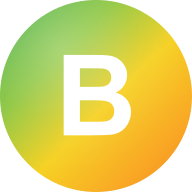

# Brilla Study Platform

<div align="center">



# **Brilla Study Platform**

### Ghana's Premier AI-Powered Exam Preparation Platform

[](https://brillagh.com)
[](https://reactjs.org/)
[](https://www.typescriptlang.org/)
[](https://workers.cloudflare.com/)
[](https://tailwindcss.com/)
[](https://web.dev/progressive-web-apps/)

---

*Empowering students across Ghana and beyond to excel in **BECE**, **WASSCE**, **NSMQ**, **Cambridge IGCSE**, and **Cambridge A-Level** examinations through intelligent, personalized learning.*

[**Get Started**](https://brillagh.com) | [**Features**](#features) | [**Tech Stack**](#tech-stack) | [**Documentation**](#documentation)

</div>

---

## Overview

**Brilla Study Platform** is a comprehensive, AI-powered educational platform designed for students preparing for national and international examinations. Built with cutting-edge technology and deep understanding of both Ghanaian and Cambridge curricula, Brilla provides an engaging, gamified learning experience that makes exam preparation effective and enjoyable.

### Why Brilla?

- **Adaptive Learning** - AI-powered question selection that focuses on your weak areas
- **Exam-Authentic** - Questions following real WAEC and Cambridge formats
- **24/7 AI Tutor** - Get help anytime with our Llama 3.3 70B-powered tutor
- **Gamified Experience** - XP, streaks, battles, and leaderboards keep you motivated
- **Works Offline** - PWA support for studying without internet
- **Ghana-First Design** - Built with Ghanaian students in mind, with local curriculum support

### Key Statistics

| Metric | Value |
|--------|-------|
| Practice Questions | **4,000+** |
| Subjects Covered | **50+** |
| Exam Systems | **5** (BECE, WASSCE, NSMQ, IGCSE, A-Level) |
| Database Migrations | **100+** |
| Active Features | **30+** |

---

## Supported Examinations

<div align="center">

| Exam | Level | Subjects | Status |
|------|-------|----------|--------|
| **BECE** | JHS | 8 Core Subjects | ✅ Full Support |
| **WASSCE** | SHS | 50+ Subjects | ✅ Full Support |
| **NSMQ** | SHS | Maths, Physics, Chemistry, Biology | ✅ Full Support |
| **Cambridge IGCSE** | O-Level | Physics, Chemistry, Biology, Mathematics | ✅ Full Support |
| **Cambridge A-Level** | Pre-University | Physics, Chemistry, Biology, Mathematics | ✅ Full Support |

</div>

### Ghana National Exams

#### BECE (Basic Education Certificate Examination)
- **Core Subjects:** English Language, Mathematics, Integrated Science, Social Studies
- **Additional:** RME, BDT, ICT, French, Ghanaian Language

#### WASSCE (West African Senior School Certificate Examination)
- **Core 4:** English, Core Mathematics, Integrated Science, Social Studies
- **Sciences:** Physics, Chemistry, Biology, Elective Mathematics
- **Business:** Economics, Accounting, Business Management, Cost Accounting
- **Arts:** Literature, Government, History, Geography, CRS/IRS
- **Vocational:** Foods & Nutrition, Technical Drawing

#### NSMQ (National Science & Maths Quiz)
- Speed-based competition preparation
- Round simulations (Speed Race, Problem of the Day, True/False, Riddles)
- Real-time battle mode for team practice

### Cambridge International Exams

#### Cambridge IGCSE (O-Level)
| Subject | Syllabus Code | Papers |
|---------|---------------|--------|
| Physics | 0625 | Paper 1 (MCQ), Paper 2 (Core), Paper 4 (Extended), Paper 6 (ATP) |
| Chemistry | 0620 | Paper 1 (MCQ), Paper 2 (Core), Paper 4 (Extended), Paper 6 (ATP) |
| Biology | 0610 | Paper 1 (MCQ), Paper 2 (Core), Paper 4 (Extended), Paper 6 (ATP) |
| Mathematics | 0580 | Paper 1 (Non-Calc), Paper 2 (Extended), Paper 4 (Extended) |

#### Cambridge A-Level
| Subject | Syllabus Code | Papers |
|---------|---------------|--------|
| Physics | 9702 | Paper 1 (MCQ), Paper 2 (AS), Paper 3 (Practical), Paper 4 (A2), Paper 5 (Planning) |
| Chemistry | 9701 | Paper 1 (MCQ), Paper 2 (AS), Paper 3 (Practical), Paper 4 (A2), Paper 5 (Planning) |
| Biology | 9700 | Paper 1 (MCQ), Paper 2 (AS), Paper 3 (Practical), Paper 4 (A2), Paper 5 (Planning) |
| Mathematics | 9709 | Paper 1 (Pure 1), Paper 3 (Pure 3), Paper 4 (Mechanics), Paper 6 (Statistics) |

---

## Features

### Core Learning

| Feature | Description |
|---------|-------------|
| **Smart Practice** | Adaptive questions based on performance, weak areas, and syllabus coverage |
| **Mock Exams** | Timed exams replicating real conditions with authentic formats |
| **Past Papers** | Official past papers with mark schemes and examiner reports |
| **Topic Browser** | Navigate syllabi by topic with mastery tracking |
| **AI Tutor** | 24/7 tutoring powered by Llama 3.3 70B with LaTeX math support |
| **Essay Practice** | AI-graded essays with detailed feedback and model answers |

### Gamification & Engagement

| Feature | Description |
|---------|-------------|
| **XP & Levels** | Earn experience points and level up through activities |
| **Daily Streaks** | Maintain study streaks with streak shields and freeze protection |
| **House Cup** | Compete in houses: Ashanti, Volta, Northern, Coastal |
| **Leaderboards** | Daily, weekly, monthly, and all-time rankings |
| **Achievements** | 50+ badges for milestones and accomplishments |
| **Quests** | Daily and weekly challenges for bonus rewards |

### Social Learning

| Feature | Description |
|---------|-------------|
| **Battle Mode** | Real-time quiz battles against friends or random opponents |
| **Study Groups** | Create and join study groups with classmates |
| **Community Forums** | Discussion boards and peer support |
| **Friends System** | Connect and track each other's progress |
| **Chat** | Real-time messaging with study partners |

### Advanced Features

| Feature | Description |
|---------|-------------|
| **AI Career Counselor** | Personalized career guidance based on performance |
| **Parent Dashboard** | Real-time progress monitoring for parents |
| **Teacher Portal** | Assessment creation, grading, and student tracking |
| **E-Library** | Digital textbooks, past papers, and study materials |
| **Interactive Whiteboard** | Drawing tool for math and science problems |
| **Tutoring Marketplace** | Connect with qualified tutors |

---

## Tech Stack

### Frontend
```
React 18        - Modern UI with concurrent features
TypeScript 5.6  - Type-safe development
Tailwind CSS    - Utility-first styling with Ghana flag theme
Framer Motion   - Smooth animations and transitions
Zustand         - Lightweight state management
React Router 6  - Client-side routing
Recharts        - Data visualization and analytics
KaTeX           - Mathematical equation rendering
Lucide React    - Beautiful, consistent icons
```

### Backend
```
Cloudflare Workers  - Edge computing for global low-latency
Hono               - Ultra-fast web framework (100k req/s+)
Cloudflare D1      - SQLite at the edge
Cloudflare R2      - Object storage for media
Workers AI         - Llama 3.3 70B inference
```

### Infrastructure
```
Vite              - Next-generation build tool
PWA               - Installable progressive web app
Cloudflare Pages  - Global CDN deployment
GitHub Actions    - CI/CD pipelines
```

---

## Project Structure

```
brilla-study-platform/
├── src/
│   ├── components/          # Reusable UI components
│   │   ├── ai/             # AI tutor, counselor, essay grader
│   │   ├── auth/           # Authentication flows, exam type selector
│   │   ├── battle/         # Real-time quiz battles
│   │   ├── dashboard/      # Dashboard widgets, flyers, hero
│   │   ├── exam/           # Exam mode, question cards, timer
│   │   ├── gamification/   # XP, streaks, achievements, quests
│   │   ├── learning/       # Study plans, readiness gauge
│   │   └── subscription/   # Premium features, usage tracking
│   ├── pages/              # Route pages (40+ pages)
│   ├── stores/             # Zustand state stores
│   ├── hooks/              # Custom React hooks
│   ├── lib/                # API client, utilities
│   ├── types/              # TypeScript definitions
│   ├── config/             # Exam configs, freemium rules
│   └── data/               # Static exam data, subjects
├── workers/
│   └── api/                # Cloudflare Workers API
│       └── index.ts        # 50+ API routes
├── database/
│   └── migrations/         # D1 migrations (100+)
├── public/                 # PWA manifest, icons, assets
└── docs/                   # Documentation
```

---

## Getting Started

### Prerequisites

- Node.js 18+
- npm or yarn
- Cloudflare account (for Workers and D1)
- Wrangler CLI (`npm install -g wrangler`)

### Installation

```bash
# Clone the repository
git clone https://github.com/ghwmelite-dotcom/brilla-study-platform.git
cd brilla-study-platform

# Install dependencies
npm install

# Set up environment variables
cp .env.example .env.local
# Configure VITE_API_URL in .env.local

# Start development
npm run dev        # Frontend on http://localhost:3000
npm run dev:api    # API on http://localhost:8787
```

### Database Setup

```bash
# Create D1 database
wrangler d1 create brilla-db

# Run all migrations
for file in database/migrations/*.sql; do
  wrangler d1 execute brilla-db --file="$file"
done
```

### Deployment

```bash
# Build frontend
npm run build

# Deploy API to Cloudflare Workers
wrangler deploy

# Frontend auto-deploys via Cloudflare Pages on push
```

---

## API Overview

| Category | Endpoints | Description |
|----------|-----------|-------------|
| **Auth** | `/api/auth/*` | Login, register, OAuth, email verification |
| **Questions** | `/api/questions/*` | Practice, exams, by topic/subject |
| **Papers** | `/api/papers/*` | Past papers, mock exams, attempts |
| **Progress** | `/api/progress/*` | XP, streaks, achievements, analytics |
| **Social** | `/api/friends/*`, `/api/groups/*` | Social features |
| **Battle** | `/api/battle/*` | Real-time quiz battles |
| **AI** | `/api/ai/*` | Tutor, counselor, essay grading |
| **Admin** | `/api/admin/*` | User management, content, analytics |

---

## Screenshots

<div align="center">

| Feature | Description |
|:-------:|:-----------:|
| **Dashboard** | Personalized exam-specific dashboard with progress tracking |
| **Practice Mode** | Adaptive question practice with instant feedback |
| **AI Tutor** | 24/7 intelligent tutoring with LaTeX math support |
| **Mock Exams** | Timed examinations following real exam formats |
| **Leaderboards** | Competitive rankings across schools and regions |
| **Mobile PWA** | Fully responsive design, installable on any device |

</div>

---

## Roadmap

### In Progress
- [ ] Offline mode with service worker caching
- [ ] Edexcel IGCSE and A-Level support
- [ ] More Cambridge subjects (English, Economics, Business)

### Planned
- [ ] Voice-based AI tutoring
- [ ] Video lessons integration
- [ ] School administration portal
- [ ] Regional competitions platform
- [ ] Native mobile apps (iOS & Android)
- [ ] West African expansion (NECO, JAMB, WAEC Nigeria)

---

## Contributing

We welcome contributions! Please follow these guidelines:

1. Fork the repository
2. Create a feature branch (`git checkout -b feature/amazing-feature`)
3. Commit your changes (`git commit -m 'Add amazing feature'`)
4. Push to the branch (`git push origin feature/amazing-feature`)
5. Open a Pull Request

### Code Style
- Follow TypeScript best practices
- Use meaningful variable and function names
- Write tests for new features
- Update documentation as needed

---

## Support

| Channel | Link |
|---------|------|
| **Website** | [brillagh.com](https://brillagh.com) |
| **Email** | brillaprepgh@gmail.com |
| **Help Center** | [brillagh.com/help](https://brillagh.com/help) |
| **Issues** | [GitHub Issues](https://github.com/ghwmelite-dotcom/brilla-study-platform/issues) |

---

## License

This project is proprietary software. All rights reserved.

Copyright (c) 2024-2025 Brilla Study Platform

---

## Acknowledgments

- **Ghana Education Service** - Curriculum guidance and standards
- **WAEC** - Examination formats and past papers
- **Cambridge Assessment** - International examination frameworks
- **Anthropic** - Claude AI for development assistance
- **Cloudflare** - Edge infrastructure and AI
- **Open Source Community** - Amazing tools and libraries

---

<div align="center">

### Built with love for students across Ghana and Africa

**"Sanbra Brilla - Shine Bright, Study Smart"**

---

Made with React, TypeScript, and Cloudflare Workers

[](https://brillagh.com)
[](https://github.com/ghwmelite-dotcom/brilla-study-platform)

</div>
