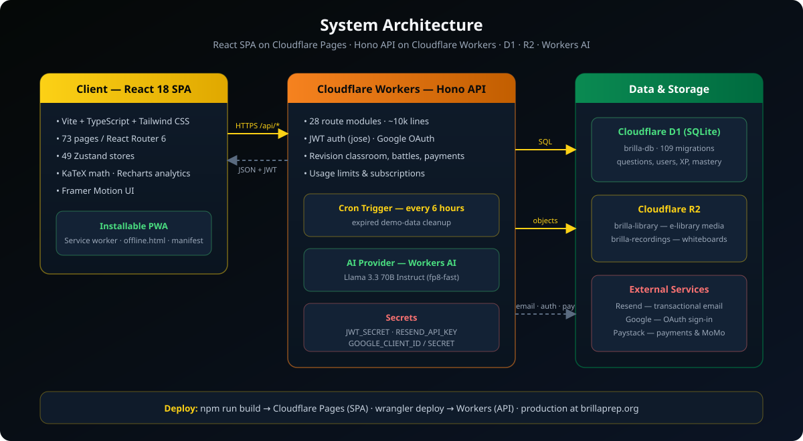

<p align="center">
  
</p>

<p align="center">
  <a href="https://brillaprep.org"></a>
  
  
  
  
  
</p>

<p align="center">
  <strong>AI-powered exam preparation for BECE, WASSCE, NSMQ, and Cambridge IGCSE / A-Level — built in Ghana, for Ghanaian students first.</strong>
</p>

<p align="center">
  <a href="#overview">Overview</a> ·
  <a href="#key-features">Features</a> ·
  <a href="#architecture">Architecture</a> ·
  <a href="#tech-stack">Tech Stack</a> ·
  <a href="#getting-started">Getting Started</a> ·
  <a href="#project-structure">Structure</a> ·
  <a href="#roadmap">Roadmap</a> ·
  <a href="#contributing">Contributing</a>
</p>

---

## Overview

**Brilla Study Platform** is a full-stack, AI-driven exam preparation platform serving students across Ghana and beyond. It combines an exam-authentic question bank and past-paper library with a proactive **AI Revision Classroom**, a 24/7 AI tutor, real-time quiz battles, and deep gamification (XP, streaks, houses, quests, leaderboards) — all delivered as an installable PWA backed by a serverless Cloudflare edge stack.

The platform supports five exam systems end-to-end:

| Exam | Level | Coverage |
|------|-------|----------|
| **BECE** | JHS | Core subjects incl. English, Maths, Integrated Science, Social Studies, RME, ICT, French |
| **WASSCE** | SHS | Core, science, business, arts and vocational electives |
| **NSMQ** | SHS | Speed-race, Problem of the Day, True/False and riddle round simulations |
| **Cambridge IGCSE** | O-Level | Physics (0625), Chemistry (0620), Biology (0610), Mathematics (0580) |
| **Cambridge A-Level** | Pre-university | Physics (9702), Chemistry (9701), Biology (9700), Mathematics (9709) |

## Key Features

<table>
  <tr>
    <td align="center" width="33%">
      <br>
      <strong>AI Revision Classroom</strong><br>
      <sub>A proactive AI teacher that leads structured lessons — Hook &#8594; Explain &#8594; Check &#8594; Practice &#8594; Confirm &#8594; Connect — with checkpoints and mastery tracking via spaced repetition.</sub>
    </td>
    <td align="center" width="33%">
      <br>
      <strong>24/7 AI Suite</strong><br>
      <sub>Llama 3.3 70B tutor with KaTeX math rendering, an AI essay grader with mark schemes, and an AI career counselor.</sub>
    </td>
    <td align="center" width="33%">
      <br>
      <strong>Exam-Authentic Practice</strong><br>
      <sub>Adaptive smart practice, timed mock exams, and official past papers with mark schemes across all five exam systems.</sub>
    </td>
  </tr>
  <tr>
    <td align="center">
      <br>
      <strong>Gamified Learning</strong><br>
      <sub>XP and levels, daily streaks with shields, 50+ achievements, daily/weekly quests, and the four-house House Cup.</sub>
    </td>
    <td align="center">
      <br>
      <strong>Battles &amp; Study Rooms</strong><br>
      <sub>Real-time solo and team quiz battles, multiplayer study rooms, friends, chat, and community forums.</sub>
    </td>
    <td align="center">
      <br>
      <strong>Parents, Teachers &amp; Admins</strong><br>
      <sub>Parent dashboards with reports and notifications, teacher assessment builder and grading, plus a full admin and moderation portal.</sub>
    </td>
  </tr>
</table>

Also on board: an **e-library** with multimedia content (R2-backed), an **interactive whiteboard** with recorded sessions, a **tutoring marketplace**, an **affiliate program**, and **subscriptions &amp; payments** via Paystack (incl. mobile money).

## Architecture

<p align="center">
  
</p>

The frontend is a React 18 SPA (73 route pages, 49 Zustand stores) built with Vite and deployed to Cloudflare Pages. The backend is a single Cloudflare Worker running a Hono router with 28 route modules (`workers/api/index.ts`), backed by Cloudflare D1 (SQLite — canonical schema plus a maintained post-squash migration chain; the original 001-087 chain is archived), two R2 buckets (e-library media, whiteboard recordings), and Workers AI (Llama 3.3 70B) for all AI features. A cron trigger runs every six hours to clean up expired demo data. Email goes through Resend, sign-in supports Google OAuth, and payments run through Paystack.

## Tech Stack

| Layer | Technology |
|-------|------------|
| **Frontend** | React 18.3, TypeScript 5.6, Vite 5, Tailwind CSS 3.4, Framer Motion, Zustand 5, React Router 6 |
| **Specialized UI** | KaTeX (math), Recharts (analytics), Fabric.js (whiteboard), react-pdf, Lucide icons |
| **Backend** | Cloudflare Workers, Hono 4, jose (JWT auth) |
| **Data** | Cloudflare D1 (SQLite at the edge), Cloudflare R2 (object storage) |
| **AI** | Cloudflare Workers AI — `@cf/meta/llama-3.3-70b-instruct-fp8-fast` |
| **Services** | Resend (email), Google OAuth, Paystack (payments &amp; MoMo) |
| **Tooling** | Wrangler 4, ESLint 9, PostCSS, PWA (service worker + manifest) |

## Getting Started

### Prerequisites

- Node.js 18+
- A Cloudflare account with the [Wrangler CLI](https://developers.cloudflare.com/workers/wrangler/)

### Installation

```bash
git clone https://github.com/ghwmelite-dotcom/brilla-study-platform.git
cd brilla-study-platform
npm install

# Frontend env: point the SPA at the API
cp .env.example .env.local   # VITE_API_URL=http://localhost:8787/api
```

### Run locally

```bash
npm run dev        # Frontend (Vite) on http://localhost:3000
npm run dev:api    # API (wrangler dev) on http://localhost:8787
npm run dev:all    # Both, via concurrently
```

### Database

The migration chain 001-087 was squashed on 2026-08-11 into a canonical
`database/schema.sql` + `database/seed.sql`. The old files are preserved
untouched in `database/migrations/archive/` (outside `migrations_dir`, so
wrangler ignores them); `database/migrations/` now holds the maintained
post-squash chain from `088` through `360`.

`schema.sql` also folds in the DDL of ten post-squash migrations (090, 091,
092, 095, 096, 097, 099, 276, 277, 282 — each marked in place). Those files
are not idempotent, so on a fresh database they can never run again; the
bootstrap records them as applied in wrangler's `d1_migrations` bookkeeping
table (`npm run db:baseline:fresh`) before `migrations apply` continues with
the rest of the chain.

Fresh environment — single bootstrap path:

```bash
wrangler d1 create brilla-db
npm run db:schema          # schema.sql — FRESH databases only, not idempotent
npm run db:seed            # seed.sql — idempotent, safe to re-run
wrangler d1 execute brilla-db --local --file=database/seeds/seed_chat_rooms.sql
npm run db:seed:topics     # topic seeds required by the guarded topic-mapping migrations (225+)
npm run db:baseline:fresh  # record folded migrations in d1_migrations — FRESH databases only
npm run db:baseline        # wrangler d1 migrations apply → applies 088…360 minus the folded ten
npm run db:verify          # gate — must be green
```

For a remote environment (e.g. staging), run the same files in the same order
with `wrangler d1 execute brilla-db-staging --env staging --remote --file=...`
and `wrangler d1 migrations apply brilla-db-staging --env staging --remote`.

`npm run db:verify` is the database gate (node:sqlite, zero deps): it applies
schema + seed with `foreign_keys=ON` and checks MCQ answer format, letter-answer
ranges, first-letter collisions, FK resolution, and duplicate subjects, then
simulates the full fresh-environment bootstrap above — baseline record plus a
replay of all ~270 live migrations — so the bootstrap path cannot regress
silently. Run it before committing anything under `database/`. CI runs it on
every PR and push to `main` via `.github/workflows/ci.yml` (step "Verify
database schema and migrations", alongside tests, typecheck, lint, and build).

Windows notes:

- `npm run db:backup` embeds `$(date ...)` — works in Git Bash / POSIX shells
  only; it will not expand in cmd.exe or PowerShell.
- `wrangler d1 execute --local --file=database/seed.sql` can crash workerd on
  Windows (miniflare `kj HashIndex` internal error on the 4,545-row file). The
  SQL is fine — `db:verify` proves it. Workaround: load the seed locally via
  better-sqlite3 / `node:sqlite`, or run wrangler per-statement.

Existing/production databases do NOT use the bootstrap above; follow the
runbook in `docs/superpowers/plans/2026-08-03-fix-05-database-reckoning.md`.

### Worker secrets

```bash
wrangler secret put JWT_SECRET
wrangler secret put RESEND_API_KEY
wrangler secret put GOOGLE_CLIENT_ID
wrangler secret put GOOGLE_CLIENT_SECRET
```

### Build &amp; deploy

```bash
VITE_DEPLOYMENT_TARGET=production VITE_API_URL=https://brilla-api.ghwmelite.workers.dev/api npm run build
# Pre-build target/API validation, tsc -b, Vite, then fail-closed Pages CSP generation
npm run lint       # ESLint
wrangler deploy    # API to Cloudflare Workers
```

Every Pages build must set both `VITE_DEPLOYMENT_TARGET` and the exact approved
`VITE_API_URL` ending in `/api`; validation runs before Vite compiles the
bundle. In PowerShell, set both environment variables explicitly. Automatic
Counselor Brie onboarding defaults off and must be opted in only after the
authenticated production QA gate passes.

## Project Structure

```
brilla-study-platform/
├── src/
│   ├── components/        # 46 UI domains: ai, battle, exam, gamification,
│   │                      #   whiteboard, parent, subscription, tutor-classroom...
│   ├── pages/             # 73 route pages (RevisionClassroom, Battle, MockExams,
│   │                      #   ParentDashboard, AdminAnalytics, HouseCup, ...)
│   ├── stores/            # 49 Zustand stores (auth, exam, battle, quest, ...)
│   ├── hooks/  lib/  services/  utils/
│   ├── config/            # examConfig, freemiumConfig
│   └── data/              # static exam & subject data
├── workers/api/           # Hono Worker — 28 route modules
│   ├── index.ts           #   router, auth, cron handler (~10k lines)
│   ├── revision-classroom.ts
│   └── ...                # tutor, teambattles, payments, whiteboards, ...
├── database/            # canonical schema.sql + seed.sql; migrations/ holds
│   │                    #   the maintained post-squash chain through 098;
│   │                    #   migrations/archive/ preserves 001-087 untouched
├── public/                # PWA manifest, service worker, icons, offline page
├── scripts/               # PWA icon/asset generators
└── docs/                  # platform docs, user manual, README assets
```

## Roadmap

**Shipped**
- AI Revision Classroom with 6-phase pedagogy and spaced-repetition mastery
- Cambridge IGCSE &amp; A-Level subject coverage
- Multiplayer study rooms, team battles, House Cup, quests &amp; achievements
- Teacher assessment builder, parent dashboards, tutoring marketplace

**In progress**
- Edexcel IGCSE / A-Level support
- Voice-based AI tutoring
- Expanded Cambridge subjects (English, Economics, Business)

**Planned**
- Native mobile apps (iOS &amp; Android)
- School administration portal and regional competitions
- West African expansion (NECO, JAMB, WAEC Nigeria)

## Contributing

Contributions are welcome:

1. Fork the repository
2. Create a feature branch: `git checkout -b feature/amazing-feature`
3. Commit your changes and push the branch
4. Open a Pull Request

Please follow the existing TypeScript conventions, run `npm run lint` before submitting, and update documentation when behavior changes.

## License

This project is proprietary software. All rights reserved.

Copyright (c) 2024–2026 Brilla Study Platform.

---

<p align="center">
  <strong>Sanbra Brilla — shine bright, study smart.</strong><br>
  <sub>Built with React, TypeScript, and Cloudflare Workers · Made in Ghana</sub><br><br>
  <a href="https://brillaprep.org"></a>
  <a href="https://github.com/ghwmelite-dotcom/brilla-study-platform"></a>
</p>
